```mermaid
graph LR
    A[🔐 Security Research] --> B[🤖 AI Security]
    A --> C[🔴 Red Teaming]
    B --> D[🛡️ ML Model Security]
    C --> E[⚡ Automation Tools]
    D --> F[🎯 Vulnerability Research]
    E --> F
```

<div align="center">
  
</div>

<div align="center">
  
</div>

<div align="center">
  
<!-- Professional Introduction -->
<h2>👋 Hi, I'm <span style="color: #FF6B6B;">Rajiv Rathod</span></h2>

<p align="center">
  
  
  
</p>

<p align="center">
  🌍 <strong>Based in Muscat, Oman</strong> | 🎯 <strong>Focused on Cybersecurity & AI</strong><br>
  🔐 <strong>Passionate about Red Teaming</strong> | ⚡ <strong>Building Security Automation</strong><br>
  🚀 <strong>Self-taught Developer since 2021</strong> | 🛡️ <strong>Breaking & Securing Systems</strong>
</p>

<!-- Dynamic Stats -->
<p align="center">
  
  
  
</p>

</div>

<div align="center">

### 📑 Quick Navigation
<p align="center">
  <a href="#-about-me">🧑‍💻 About</a> • 
  <a href="#️-cybersecurity-arsenal">🛡️ Security</a> • 
  <a href="#️-tech-stack--tools">🛠️ Tech Stack</a> • 
  <a href="#-featured-projects">🚀 Projects</a> • 
  <a href="#-github-analytics--activity">📊 Stats</a> • 
  <a href="#-what-im-working-on">🎯 Current Work</a> • 
  <a href="#-lets-connect--collaborate">🌐 Connect</a>
</p>

</div>

---

## 👨‍💻 About Me

<table align="center">
<tr>
<td>

```python
class RajivRathod:
    def __init__(self):
        self.name = "Rajiv Rathod"
        self.role = "Security Researcher & Developer"
        self.location = "Muscat, Oman 🇴🇲"
        self.coding_since = "2021"
        self.languages_spoken = ["English", "Hindi", "Arabic"]
        
    def current_focus(self):
        return [
            "🔴 Red Team Operations",
            "🤖 AI Security Research", 
            "⚡ Security Automation",
            "🛡️ Penetration Testing"
        ]
        
    def fun_fact(self):
        return "I break things to understand how to build them better! 💥"
```

</td>
<td>

**🚀 Quick Facts:**
- 🎯 **Mission**: Building secure & intelligent systems
- 🧠 **Learning**: AI Security & Red Team Tactics
- 💡 **Passion**: Turning vulnerabilities into solutions
- 🎮 **When not coding**: CTF challenges & bug hunting
- ☕ **Fuel**: Coffee & curiosity
- 🌱 **Growing**: Open source contributions

</td>
</tr>
</table>  

---

## 🛡️ Cybersecurity Arsenal

<div align="center">
  
| 🔴 **Red Team** | 🤖 **AI Security** | 🔍 **Penetration Testing** | ⚡ **Automation** |
|:---:|:---:|:---:|:---:|
|  |  |  |  |
| Social Engineering | ML Model Security | OWASP Top 10 | CI/CD Security |
| Adversarial Tactics | Prompt Injection | Network Analysis | SIEM Integration |
| Threat Simulation | AI Red Teaming | Web App Testing | Security Scripting |

</div>

<div align="center">
  
</div>

---

## 🛠️ Tech Stack & Tools

### 💻 Programming Languages
<p align="center">
  
  
  
  
  
</p>

### 🌐 Web Technologies
<p align="center">
  
  
  
  
  
</p>

### 🗄️ Databases & Storage
<p align="center">
  
  
  
  
</p>

### ☁️ Cloud & DevOps
<p align="center">
  
  
  
  
  
</p>

### 🤖 AI/ML & Security Tools
<p align="center">
  
  
  
  
  
</p>

### 🐧 Operating Systems
<p align="center">
  
  
  
  
</p>

---

## 🚀 Featured Projects

<div align="center">
<table>
<thead>
<tr>
<th align="center">Project</th>
<th align="center">Description</th>
<th align="center">Tech Stack</th>
<th align="center">Links</th>
</tr>
</thead>
<tbody>
<tr>
<td align="center">🤖 <strong>Stealth.AI</strong></td>
<td align="center">AI-powered intelligent group chat bots for Telegram with advanced NLP capabilities</td>
<td align="center">


</td>
<td align="center"><a href="https://rxd.my.canva.site/stealth-ai">🌐 Visit</a></td>
</tr>
<tr>
<td align="center">🌍 <strong>Global Diplomacy Forum</strong></td>
<td align="center">Youth-led platform fostering international dialogue through online Model UN conferences</td>
<td align="center">


</td>
<td align="center"><a href="https://rxd.my.canva.site/gdf">🌐 Visit</a></td>
</tr>
</tbody>
</table>
</div>

<div align="center">
<h3>🔥 Current Focus Areas</h3>


</div>  

---

## 🌐 Let's Connect & Collaborate

<div align="center">

### 📫 Reach Out
<a href="https://www.linkedin.com/in/rajiv-rathod/" target="_blank">
  
</a>
<a href="mailto:rajiv.yupp@gmail.com" target="_blank">
  
</a>
<a href="https://discordapp.com/users/1047122437839523882" target="_blank">
  
</a>
<a href="https://www.instagram.com/sk.rajiv_rathod/" target="_blank">
  
</a>

### 🤝 Open to
- 🔐 **Security Research Collaborations**
- 🚀 **Open Source Contributions**
- 💼 **Freelance Security Projects**
- 🎓 **Mentoring & Knowledge Sharing**
- 🌍 **Speaking at Security Events**

</div>

---

## 📊 GitHub Analytics & Activity

<div align="center">
  
  
  
  
</div>

<div align="center">
  
</div>

<div align="center">
  
### 🏆 GitHub Trophies
  
  
</div>

## 🎯 What I'm Working On

<div align="center">
<table>
<tr>
<td>

```typescript
interface CurrentProjects {
  🔐 security_research: {
    focus: "AI/ML Security Vulnerabilities",
    tools: ["TensorFlow", "PyTorch", "Custom Scripts"],
    status: "Active Research"
  },
  
  🤖 ai_red_teaming: {
    focus: "Adversarial ML & Prompt Injection",
    tools: ["LangChain", "OpenAI API", "Custom Frameworks"],
    status: "Proof of Concept"
  },
  
  ⚡ automation_tools: {
    focus: "Security Testing Automation",
    tools: ["Python", "Bash", "GitHub Actions"],
    status: "Development"
  }
}
```

</td>
</tr>
</table>
</div>

---

<div align="center">

### 🐍 Watch the Snake Eat My Contributions!


### 💭 Random Dev Quote


### 📈 Weekly Development Breakdown
<table align="center">
<tr>
<td>

```text
🔐 Security Research    ████████████████████░   80%
🤖 AI/ML Learning       ████████████████░░░░░   65%
💻 Coding Projects      ██████████████░░░░░░░   55%
📚 Reading & Research   ████████████░░░░░░░░░   45%
🎯 CTF Challenges       ██████████░░░░░░░░░░░   35%
```

</td>
</tr>
</table>

### ⚡ Fun Facts
🔥 **Lines of Code Written**: More than I can count (and debug)<br>
☕ **Coffee Consumed**: Enough to power a small server<br>
🐛 **Bugs Created**: Feature, not bug! (Usually...)<br>
🛡️ **Security Mindset**: Always assume breach<br>
🌟 **Motto**: *"Break it, fix it, secure it, repeat"*

---


<p align="center">
  <i>⚡ "The best way to learn security is to break things and fix them" ⚡</i><br>
  <sub>Made with ❤️ and lots of ☕ by <a href="https://github.com/rajiv-rathod">@rajiv-rathod</a></sub>
</p>


</div>
